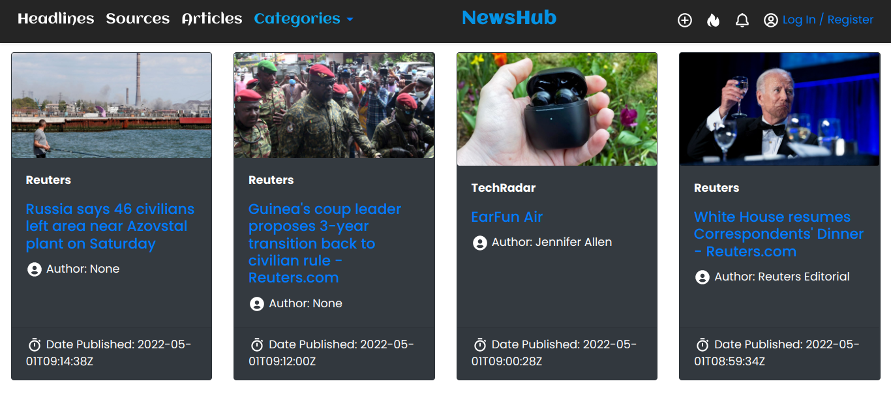

# newsapi
### It is a python web application that allows users to view news, select a news source and see all news articles from the selected news source. 

### NewsHub Homepage
<!--  -->

## Description
newsapi web application is built using Python framework (Flask) and NEWS API. The app displays information about news articles from popular sources, top headlines around the world, provides new categories and the various sources available.

## Author
Nazarena Wambura. 
[Github](https://github.com/nazarena254)

## Technologies used
* Python3.9
* Flask2.1.1
* Markdown

## Behaviour Driven Development / BDD
* Given the user opens the live link, various news sources and a navbar on the homepage can be seen on the web application.
* When user selects a news source he will see all news articles, image, description and the time a news article was created in the application.
* Then the user can also click on an article and read the full article on the source website

## Installed packages
* Install code editor of your choice.
* Run `sudo apt-get update`,`sudo apt-get install python3.6` in terminal to install python.
* Install python extension in code editor(VScode) to run python modules easily.
* Run `python3.9 -m venv --without-pip virtual` in terminal to install virtual environment.
* Run `source virtual/bin/activate` to activate and `.../deactivate` to deactivate virtual env.
* Run `curl https://bootstrap.pypa.io/get-pip.py | python` to install pip in virtual env.
* Run `pip install newsapi-python` to install python client library that integrates News API into my python application
* Run `pip install flask` in terminal to install flask. 
* To deploy on heroku, you will need to install/do the following:
   - outline dependencies `pip freeze`  
   - add dependencies in requirements.txt file `pip freeze > requirements.txt`
   - heroku cli `npm install -g heroku`
   - gunicorn  `python3.9 -m pip install gunicorn`
   - nano  `sudo apt install nano`

## Installation / Setup instruction
* Open Terminal {Ctrl+Alt+T}
* create and cd to the directory where you want to have your project
* git clone `https://github.com/nazarena254/newsapi.github.io.git` to have it locally.
* code . or atom . based on the text editor you have.
* work on it.

## License
Distributed under [MIT license](). 
Copyright (c) 2022 Nazarena Wambura

## Support and Contact
Incase of another bug email me. 
<nancyngunjiri1@gmail.com>